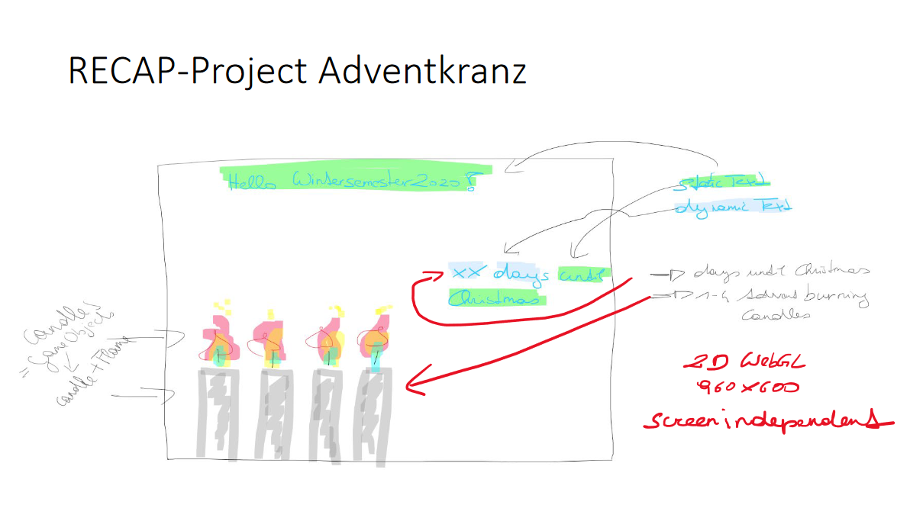
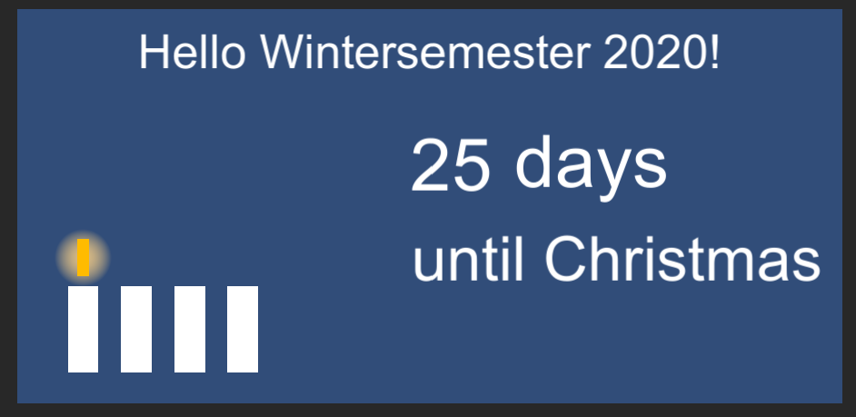

# Adventkranz-nima

### Project description: 

In this project we will create a kind of countdown until christmas day.
The design is pretty minimalistic with a solid background and four candles for each Advent Sunday - a scribble can be found under the bulletpoint "Visuals"

### Development platform: 

* Windows 10
* Unity Version: 2020.1.5f1
* Visual Studio 2019

### Target platform: 

* 2D WebGL (960 x 600 screenindependent)

### Visuals: 

### Necessary setup/execution steps: 

* none

### Third party material: 

* Template2D-Unity202015f1

### Project state: 

* 100%

### Limitations: 

* None

### Lessons Learned: 

* Revision of C# basics
* Revision of Github and creating a repository
* Revision of building scenes

* Definition SC: A ScriptableObject is a data container that you can use to save large amounts of data, independent of class instances
* Why using a SC? 
	* Saving and storing data during an Editor session
	* Saving data as an Asset in your Project to use at run time
* How to create a SC:
	* Create script in Assets folder
	* Instead of writing MonoBehaviour, we write ScriptableObject in our class
	* Fill script with data of object
	* Use CreateAssetMenu attribute to create custom assets using your class
	* Create an instance of ScriptableObject by navigating to Assets > Create > ScriptableObjects > SpawnManagerScriptableObject
	* Add data
		

Copyright by nima
